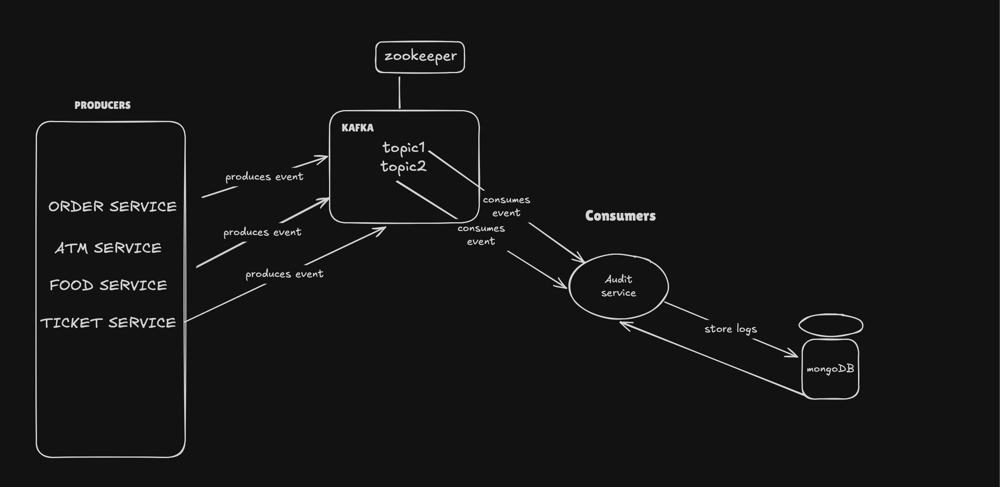

# Audit Service Documentation

## Problem Statement
**Implement the audit service for a microservices-based application**
### **Requirements:**
1. **Subscribe to Change Notifications**
    - The service listens for events from other microservices.
    - Processes and stores them in a **standard format** in the database.

2. **Audit Log APIs**
    - **Admin**: Can view **all** audit messages.
    - **Non-Admin**: Can view audit logs **only for accessible entities**.

3. **Log Rotation**
    - Implement **configurable log rotation** to prevent excessive data growth.

4. **Spring Boot-based**
    - The application must be developed using **Spring Boot**.

5. **Deployment**
    - Deploy as a **WAR file** in **Tomcat** on a **CentOS VM**.

### **Design Considerations:**
1. **Database Choice & Schema Design**
    - Optimize for **performance** with indexing and partitioning.

2. **Audit Message Format**
    - Standardize the JSON format for consistency.

3. **Intra-service Communication**
    - Use **Kafka** for event-driven logging.

4. **Tamper-proofing**
    - Implement **cryptographic hashing** to prevent log manipulation.

5. **Cross-platform Deployment**
    - Ensure compatibility across **Linux**, **Windows**, and **cloud platforms**.

6. **Scalability**
    - Design for **horizontal scaling** and **high availability**.

---
## A Note from the Developer

“This Audit Service is implemented based on my current understanding of secure and scalable logging in a microservices architecture. While it meets the core requirements, there is always room for improvement in design, performance, and security. The project can be further enhanced with additional features, optimizations, and best practices as needed. Feedback is welcome!”

---
## Description
The **Audit Service** is a microservice responsible for recording and storing audit logs generated by various services within a system. It ensures that all actions performed by users and services are logged securely and tamper-proof. The service leverages **Kafka** for event-driven message processing, **MongoDB** for scalable and flexible log storage, and **JWT (JSON Web Token)** for secure authentication and authorization.

---

## Features
- **JWT Authentication** for secure access
- **Kafka Integration** to process audit events
- **MongoDB** for storing logs efficiently
- **RSA Signature** to ensure log integrity
- **Dockerized Deployment** for portability

---

## Design


Key Components
1.	Producers (Microservices):
      •	Different services (Order Service, ATM Service, Food Service, Ticket Service) produce events.
      •	In our current implementation, we have a single ```/housekeeping/logs``` (for demo purpose) API that sends log events to Kafka. However, this can be extended to support multiple event sources.
2.	Kafka & Topics:
      •	Messages are published to Kafka topic(s) (e.g., audit_topic).
      •	The diagram shows multiple topics for a broader perspective, but currently, we are using only one topic (audit_topic).
3.	Consumers (Audit Service):
      •	The Audit Service subscribes to Kafka topics and consumes messages.
      •	Right now, we have a single consumer, but more consumers can be added for scalability.
4.	Storage (MongoDB):
      •	Logs are stored in MongoDB for audit and retrieval purposes.

---
## JWT Authentication

### How JWT Works in This Project?
1. **User logs in** → Backend verifies credentials.
2. **JWT Token is issued** → Contains user details.
3. **Client sends JWT with requests** → Backend verifies.
4. **Role-based access** ensures only authorized users access logs.

### JWT Structure
```json
{
  "alg": "HS256",
  "typ": "JWT"
}
{
  "sub": "test-125",
  "iat": 1741165477,
  "exp": 1741175477
}
```

---
## Kafka

### Why Kafka?
Kafka is used for **asynchronous, distributed, and fault-tolerant event streaming**. It ensures that audit logs are processed **at scale** without impacting the performance of microservices.

### Why Not Other Message Brokers?
| Broker        | Reason for Not Choosing |
|---------------|------------------------|
| RabbitMQ      | Not designed for event streaming at scale |
| ActiveMQ      | Lacks distributed, partitioned architecture |
| Redis Pub/Sub | Not durable, no event retention |

### How Kafka Fits in the Use Case?
1. **Producers (Microservices)** send audit logs as Kafka messages.
2. **Audit Service (Consumer)** listens, validates, and stores the logs in MongoDB.
3. Kafka ensures **high availability & fault tolerance**.

---

## MongoDB

### Why MongoDB?
- NoSQL document storage is **flexible** for dynamic audit structures.
- **High write performance** for large-scale event logging.
- Supports **indexing & partitioning** for optimized queries.

### Why Not Other Databases?
| Database   | Reason for Not Choosing |
|------------|------------------------|
| PostgreSQL | Rigid schema, lower write performance for logs |
| MySQL      | Lacks NoSQL flexibility for JSON-like logs |
| Cassandra  | Complex setup, less community support |

### How MongoDB Fits in the Use Case?
- Stores audit logs **as JSON documents**.
- Uses **indexes** for fast retrieval.
- Scalable and supports **high-throughput writes**.

---

## Audit Message Format

The Audit Service logs every action performed in the system in a structured JSON format.  
Each log entry contains metadata, user information, request details, and a **digital signature** for tamper-proofing.

#### JSON Structure
```json
{
  "_id": "ObjectId('67c813dc8079cf625dc671a7')",
  "serviceName": "OrderService",
  "eventType": "CREATE",
  "auditTimestamp": "2025-03-05T09:05:32.117Z",
  "userId": "user-123",
  "userIp": "192.168.1.1",
  "userRole": "USER",
  "sourceService": "OrderService",
  "requestId": "b2d85d5f-3856-4c7b-b282-4c69a07d8743",
  "changes": {
    "status": { "old": null, "new": "Created" },
    "totalPrice": { "old": null, "new": 200 }
  },
  "metadata": { "traceId": "abcd-1234-xyz" },
  "createdTimestamp": "2025-03-05T09:05:32.117Z",
  "updatedTimestamp": "2025-03-05T09:05:32.117Z",
  "signature": "Xs2+e7C..."
}
```

| Field Name        | Data Type                          | Description |
|------------------|----------------------------------|-------------|
| `_id`           | `ObjectId`                        | Unique identifier of the log (MongoDB auto-generated). |
| `serviceName`   | `String`                          | Name of the service generating the audit log. |
| `eventType`     | `String`                          | Type of event (`CREATE`, `UPDATE`, `DELETE`, etc.). |
| `auditTimestamp`| `ISODate`                         | Timestamp when the event occurred. |
| `userId`        | `String`                          | ID of the user who triggered the event. |
| `userIp`        | `String`                          | IP address of the user. |
| `userRole`      | `String`                          | Role of the user (`ADMIN`, `USER`, etc.). |
| `sourceService` | `String`                          | Microservice that generated the log. |
| `requestId`     | `String` (UUID)                   | Unique ID for tracking the request across services. |
| `changes`       | `Map<String, Map<String, Object>>`| Key-value pairs representing changed fields (`old` and `new` values). |
| `metadata`      | `Map<String, String>`             | Additional metadata (e.g., `traceId` for tracing). |
| `createdTimestamp` | `ISODate`                      | When the log was created in the database. |
| `updatedTimestamp` | `ISODate`                      | When the log was last updated. |
| `signature`     | `String`                          | Digital signature for tamper-proof verification. |
---

## API signatures

### Authentication API
### 1. User Signup

#### Endpoint: ``` POST http://localhost:8080/auth/signup```
#### Request Header: ```Content-Type: application/json```

#### Request Body:
```json
{
  "userName": "userA",
  "password": "1234567"
}
```
#### Response:
```json
{
  "id": {
    "timestamp": 1714224562,
    "date": "2025-03-06T06:29:22.000+00:00"
  },
  "userId": "e60949a9-9bd8-4b4c-9eed-0ec7bcb832354",
  "password": "S2A5lnQS6J7CkgX.CYNQ3x.8OkA2oKNZtA4jzn.wkPJ.0tEUE0HR8Y6Yb.",
  "createdAt": "2025-03-06T06:29:22.000Z",
  "updatedAt": "2025-03-06T06:29:22.000Z",
  "role": {
    "id": {
      "timestamp": 1714165219,
      "date": "2025-03-05T09:19:00.000+00:00"
    },
    "name": "USER",
    "description": "Default user role",
    "createdAt": "2025-03-05T09:19:00.002",
    "updatedAt": "2025-03-05T09:19:00.002"
  },
  "enabled": true,
  "authorities": [
    {
      "authority": "ROLE_USER"
    }
  ],
  "username": "userA",
  "accountNonExpired": true,
  "accountNonLocked": true,
  "credentialsNonExpired": true
}
```

### 2. User Login

#### Endpoint: ```POST http://localhost:8080/auth/login ```

#### Request Header: ```Content-Type: application/json```
#### Request Body:
```json
{
  "userName": "userA",
  "password": "1234567"
}
```
#### Response:
```json
{
  "token": "eyJhbGciOiJIUzI1NiJ9...",
  "expiresIn": 3600000
}
```

### 3. Admin Signup
To create an admin, you need the token of a Super Admin—a special user responsible for creating admins, which is pre-configured during the system bootstrap.

First, log in (refer the second endpoint above) using the Super Admin credentials to retrieve a JWT token.
#### Request Body for Super Admin User:
```json
{
  "userName": "superAdmin",
  "password": "1234567"
}
```
#### Response:
```json
{
  "token": "<superAdminJWT>",
  "expiresIn": 3600000
}
```

Let's create an admin with the JWT of superAdmin...
#### Endpoint: ```POST http://localhost:8080/admins```

#### Request Header: ```Content-Type: application/json```

#### Request Body:
```json
{
  "userName": "ADMIN-USER",
  "password": "1234567"
}
```
#### Response:
```json
{
  "id": {
    "timestamp": 1741250413,
    "date": "2025-03-06T08:40:13.000+00:00"
  },
  "userId": "350500eb-2f39-4a5f-b1e0-7d0192e9bc73",
  "password": "$2a$10$DorPFDmpQuAXNZRJcPc4JOCxScLtLeIw23tPHxYt4PX0fzH0PaaVy",
  "createdAt": "2025-03-06T08:40:13.575719966",
  "updatedAt": "2025-03-06T08:40:13.575734216",
  "role": {
    "id": {
      "timestamp": 1741165219,
      "date": "2025-03-05T09:00:19.000+00:00"
    },
    "name": "ADMIN",
    "description": "Administrator role",
    "createdAt": "2025-03-05T09:00:19.029",
    "updatedAt": "2025-03-05T09:00:19.029"
  },
  "enabled": true,
  "authorities": [
    {
      "authority": "ROLE_ADMIN"
    }
  ],
  "username": "ADMIN-USER",
  "accountNonExpired": true,
  "accountNonLocked": true,
  "credentialsNonExpired": true
}
```

### 4. Generate an audit log:
The below endpoint can be used for both Admin user and non-Admin user.
#### Endpoint: ```POST http://localhost:8080/housekeeping/logs```
#### Authentication - ```Bearer Token (JWT)```
#### Request Header: ```Content-Type: application/json```

You need to pass the userId of UserA (or any user whose log you are pushing) in the request body, along with their JWT token in Authentication, to generate an audit log.

#### Request Body:
```json
{
  "serviceName": "OrderService",
  "eventType": "CREATE",
  "auditTimestamp": "2025-03-02T12:00:00Z",
  "userId": "userA",
  "userIp": "192.168.1.1",
  "userRole": "USER",
  "sourceService": "OrderService",
  "requestId": "b2d85d5f-3856-4c7b-b282-4c69a07d8743",
  "changes": {
    "status": { "old": null, "new": "Created" },
    "totalPrice": { "old": null, "new": 200 }
  },
  "metadata": { "traceId": "abcd-1234-xyz" }
}
```
#### Response:
```json
{
  "id": {
    "timestamp": 1741247714,
    "date": "2025-03-06T07:55:14.000+00:00"
  },
  "serviceName": "OrderService",
  "eventType": "CREATE",
  "auditTimestamp": "2025-03-06T07:55:14.380682334Z",
  "userId": "userA",
  "userIp": "192.168.1.1",
  "userRole": "USER",
  "sourceService": "OrderService",
  "requestId": "b2d85d5f-3856-4c7b-b282-4c69a07d8743",
  "changes": {
    "status": {
      "old": null,
      "new": "Created"
    },
    "totalPrice": {
      "old": null,
      "new": 200
    }
  },
  "metadata": {
    "traceId": "abcd-1234-xyz"
  },
  "createdTimestamp": "2025-03-06T07:55:14.380683334Z",
  "updatedTimestamp": "2025-03-06T07:55:14.380684Z",
  "signature": "CxkkNmiIDeocPMtrP4O5ZanQFkWPuKTg81LnWFQMZcLPZM+heU4o60WzbMbfDO7nSaV/lIrttdUf2Pt+gIyryW4AaBfTNPGVXE9YFxlVD5UsMEjLp3UDkTgMItS5pRTJ1seSbAQYkePawDcxbqHSgm00jAx7S9HLEKdUGSSzDZB+pWAiPhKFitMbYPOrj1IG2bjp6/tlc1uRRSqTwaU1M+h5lT/dtoA0tIHtbica7hoy9RRCcMW7Sa+To17bHEfNHGHfUClAQyscmPmpvgJEsubALpO+UcyU4MC8euNNGm+Xc8ZMHI13RFarU2OoYwg46DA1EGl1KWBvR1v+l6w3jQ=="
}
```
### 5. Fetch Logs
#### Endpoint: GET http://localhost:8080/audit/logs

#### 5.1 Fetch all logs (Admin) :
#### Let's try fetching logs for "ADMIN-USER" (which has admin privilege) we can see all the audit logs. The "userId" attribute is the differentiator
```json
{
  "content": [
    {
      "id": {
        "timestamp": 1741165532,
        "date": "2025-03-05T09:05:32.000+00:00"
      },
      "serviceName": "OrderService",
      "eventType": "CREATE",
      "auditTimestamp": "2025-03-05T09:05:32.117Z",
      "userId": "user-123",
      "userIp": "192.168.1.1",
      "userRole": "USER",
      "sourceService": "OrderService",
      "requestId": "b2d85d5f-3856-4c7b-b282-4c69a07d8743",
      "changes": {
        "status": {
          "old": null,
          "new": "Created"
        },
        "totalPrice": {
          "old": null,
          "new": 200
        }
      },
      "metadata": {
        "traceId": "abcd-1234-xyz"
      },
      "createdTimestamp": "2025-03-05T09:05:32.117Z",
      "updatedTimestamp": "2025-03-05T09:05:32.117Z",
      "signature": "Xs2+e7CW6oDABrXb753Ts4Cr54RDBFuu2bx59UOgImZEgITiWx0OE1cA6Xm64s9yfkIpKXMVG5ZQhBbtGFc1beFPbpWvOuUYyV0DnD1ttpYlf90iO/oVakbyOlbCKAxZU//TRAXz/hTe4EEDW05TJVNi3ivJaFKSYCG1KE9VtKYGvw9b80FHLfWOtHxpVJQa8j/PY4FnFmrhz+V+NZscbBS8P7uMwVy5db7kJV7wyjE2/WQ8NDNnZ4n2r9QWhK0DGbrPijdJ34liMj0WxaR95WiRxsiH/cRBo2bKWFKHKDW43IVNpX4/xGjZPTlY/HbPdGlCrsqLcAZz2ferptjVkg=="
    },
    {
      "id": {
        "timestamp": 1741165552,
        "date": "2025-03-05T09:05:52.000+00:00"
      },
      "serviceName": "OrderService",
      "eventType": "CREATE",
      "auditTimestamp": "2025-03-05T09:05:52.355Z",
      "userId": "userA",
      "userIp": "192.168.1.1",
      "userRole": "USER",
      "sourceService": "OrderService",
      "requestId": "b2d85d5f-3856-4c7b-b282-4c69a07d8743",
      "changes": {
        "status": {
          "old": null,
          "new": "Created"
        },
        "totalPrice": {
          "old": null,
          "new": 200
        }
      },
      "metadata": {
        "traceId": "abcd-1234-xyz"
      },
      "createdTimestamp": "2025-03-05T09:05:52.355Z",
      "updatedTimestamp": "2025-03-05T09:05:52.355Z",
      "signature": "mC0gWRQqxRm7HIshJTfDUeDyg340+pod0pDzMKPjock++hQCbbg+Duzr+OO2bQUELiHWo/g7/TDs0Ub2brdNP0fMVV2mLum8yNM5b0UPUCiiYXpCFZRj879niF1kmhBLMB426x7g7oiPjnq8zul5I80tAwxjqMkFKiFglU8qR/YBNsw2DU6N9DetEOWTmsP00SRDG+xH5CgeqPQT5RJpfZSboVhXs2tSTQjpQPibWIadENYtra1qxKhp4SoAB8BMzf8CJLEAwAPMDjxbTHVhsPaa0e8INZmFfrBuUvfsC+A4EC4QytCIfzKAjQrBAnJjMB/AmsWFPs8irv1naN4xmQ=="
    },
    {
      "id": {
        "timestamp": 1741165648,
        "date": "2025-03-05T09:07:28.000+00:00"
      },
      "serviceName": "OrderService",
      "eventType": "CREATE",
      "auditTimestamp": "2025-03-05T09:07:28.116Z",
      "userId": "userB",
      "userIp": "192.168.1.1",
      "userRole": "USER",
      "sourceService": "OrderService",
      "requestId": "b2d85d5f-3856-4c7b-b282-4c69a07d8743",
      "changes": {
        "status": {
          "old": null,
          "new": "Created"
        },
        "totalPrice": {
          "old": null,
          "new": 200
        }
      },
      "metadata": {
        "traceId": "abcd-1234-xyz"
      },
      "createdTimestamp": "2025-03-05T09:07:28.116Z",
      "updatedTimestamp": "2025-03-05T09:07:28.116Z",
      "signature": "fIxKcuenvgYuPqgA96anzPqCiSMlI14nDwX/6+2quIMuuLsbDEv3bHiBuUAGlDSaUGADmibXCpJwe15Lq+ADOuygQmtfW0TPf0LnPMsd/3i2ElT/A7/eLb4dpx0rdnMsvDVokpop65SqFQSrebKK9ftyzwbUriYcIgdnHPLHQZZ19N4PcnhAQenXiQCi9FLg5T1khvl/4kd0NqFQS0H6VhY+RYnCdHUu10mBOEkPxwobg5c3Vl0alguRVTYayIFxyOh16aIivEGpJqQc51RvWSoD0cccCCjoI5x7de75AQQ8NKV3baQF450VF/kRQVwNd+tvNp34mtPn91cnKVznGw=="
    },
    {
      "id": {
        "timestamp": 1741165666,
        "date": "2025-03-05T09:07:46.000+00:00"
      },
      "serviceName": "OrderService",
      "eventType": "CREATE",
      "auditTimestamp": "2025-03-05T09:07:46.957Z",
      "userId": "user-125",
      "userIp": "192.168.1.1",
      "userRole": "USER",
      "sourceService": "OrderService",
      "requestId": "b2d85d5f-3856-4c7b-b282-4c69a07d8743",
      "changes": {
        "status": {
          "old": null,
          "new": "Created"
        },
        "totalPrice": {
          "old": null,
          "new": 200
        }
      },
      "metadata": {
        "traceId": "abcd-1234-xyz"
      },
      "createdTimestamp": "2025-03-05T09:07:46.957Z",
      "updatedTimestamp": "2025-03-05T09:07:46.957Z",
      "signature": "QLgIsUBmsmICp1AFug85E0UHxc+ywnpNZvL6eKStqA6A3XzYWlELKLLkGn72jxsaK+eC0g+cRf1imjzYfkBA9nLLyrcpAMPfrulV1YzbleOl3N2ez1jnCuEz0E83nBxGboTUsHgnjQsgHTDlyixvHG3tYxRGIMiKsIKtVkop3IOpmAN8+C25Lfdvk+cdPCJWvn4mUcSPp7eZTtRF0kWwMbd78atFuPbGHQwAvCbVyXtig+NOxbQ4pkEE7BbothH4WWEOaoHKFiF/7FIKh9E9kFs5ayl2WPIfGZuMNB4JWldQqWfdUSBHs57mYwqJSy+92gEsHJIqq9t7APzEThlaLQ=="
    }
  ],
  "pageable": {
    "pageNumber": 0,
    "pageSize": 10,
    "sort": {
      "empty": true,
      "sorted": false,
      "unsorted": true
    },
    "offset": 0,
    "paged": true,
    "unpaged": false
  },
  "last": true,
  "totalPages": 1,
  "totalElements": 4,
  "size": 10,
  "number": 0,
  "sort": {
    "empty": true,
    "sorted": false,
    "unsorted": true
  },
  "first": true,
  "numberOfElements": 4,
  "empty": false
}
```
#### 5.2 Fetch logs (Non-Admin) :
#### Let's try fetching logs of userA (which is a non-Admin user)
```json
{
  "content": [
    {
      "id": {
        "timestamp": 1741247714,
        "date": "2025-03-06T07:55:14.000+00:00"
      },
      "serviceName": "OrderService",
      "eventType": "CREATE",
      "auditTimestamp": "2025-03-06T07:55:14.380Z",
      "userId": "userA",
      "userIp": "192.168.1.1",
      "userRole": "USER",
      "sourceService": "OrderService",
      "requestId": "b2d85d5f-3856-4c7b-b282-4c69a07d8743",
      "changes": {
        "status": {
          "old": null,
          "new": "Created"
        },
        "totalPrice": {
          "old": null,
          "new": 200
        }
      },
      "metadata": {
        "traceId": "abcd-1234-xyz"
      },
      "createdTimestamp": "2025-03-06T07:55:14.380Z",
      "updatedTimestamp": "2025-03-06T07:55:14.380Z",
      "signature": "CxkkNmiIDeocPMtrP4O5ZanQFkWPuKTg81LnWFQMZcLPZM+heU4o60WzbMbfDO7nSaV/lIrttdUf2Pt+gIyryW4AaBfTNPGVXE9YFxlVD5UsMEjLp3UDkTgMItS5pRTJ1seSbAQYkePawDcxbqHSgm00jAx7S9HLEKdUGSSzDZB+pWAiPhKFitMbYPOrj1IG2bjp6/tlc1uRRSqTwaU1M+h5lT/dtoA0tIHtbica7hoy9RRCcMW7Sa+To17bHEfNHGHfUClAQyscmPmpvgJEsubALpO+UcyU4MC8euNNGm+Xc8ZMHI13RFarU2OoYwg46DA1EGl1KWBvR1v+l6w3jQ=="
    }
  ],
  "pageable": {
    "pageNumber": 0,
    "pageSize": 10,
    "sort": {
      "empty": true,
      "sorted": false,
      "unsorted": true
    },
    "offset": 0,
    "paged": true,
    "unpaged": false
  },
  "last": true,
  "totalPages": 1,
  "totalElements": 1,
  "size": 10,
  "number": 0,
  "sort": {
    "empty": true,
    "sorted": false,
    "unsorted": true
  },
  "first": true,
  "numberOfElements": 1,
  "empty": false
}
```
---
## Log Rotation in Audit Service

To prevent excessive database growth, the `MongoLogRotationService` automatically **archives and deletes old audit logs** after a configurable retention period.

- **Archival:** Older logs are saved as JSON files in an archive directory.
- **Deletion:** Logs older than the retention period are deleted after archival.
- **Scheduling:** Runs **daily at 2 AM** (configurable via cron).

---
## How to Run?
The Audit Service is fully dockerized and can be easily deployed using Docker Compose.

### Steps to Run
1.⁠ ⁠*Build the Project*
⁠ 
"mvn package -U"
    ⁠
- ⁠ -U ⁠ forces update of dependencies.
- The project is packaged as a JAR file instead of a WAR because Spring Boot applications run as standalone JARs.

2.⁠ ⁠*Run with Docker Compose*
⁠ "docker-compose up --build"
    ⁠
- ⁠ --build ⁠ ensures the latest changes are included.
- Docker orchestrates MongoDB, Kafka, and the Audit Service, ensuring all dependencies are correctly started.
---

## Dockerization
The Audit Service is containerized using Docker for portability and ease of deployment. The Docker setup includes:
•⁠  ⁠*Dockerfile*: Defines how the application is packaged and run.
•⁠  ⁠*Docker Compose*: Automates running dependencies like Kafka and MongoDB.

### Why Docker?
•⁠  ⁠Ensures consistency across different environments.
•⁠  ⁠Simplifies deployment by packaging dependencies.
•⁠  ⁠Avoids installation issues related to Kafka and MongoDB.

By using Docker, the Audit Service can be deployed efficiently across multiple environments with minimal configuration changes.

---
## Resources

Here are some of the key resources referred to while building this project:

#### General References
- [Spring Security Docs](https://spring.io/projects/spring-security)
- [Kafka Official Documentation](https://kafka.apache.org/documentation/)
- [JWT Authentication Guide](https://jwt.io/introduction/)
- [Spring Boot Security JWT Authentication and Authorization Tutorial](https://www.javaguides.net/2024/01/spring-boot-security-jwt-tutorial.html)
#### Auditing
- [Auditing Basics](https://purusinha.medium.com/creating-a-audit-service-d430957e5f13)
- [Building Audit Logs](https://medium.com/@tony.infisical/guide-to-building-audit-logs-for-application-software-b0083bb58604)
- [Implementing Role-Based Security](https://medium.com/bluecore-engineering/implementing-role-based-security-in-a-web-app-89b66d1410e4)
- [Spring Data JPA](https://docs.spring.io/spring-data/jpa/docs/current/reference/html/#auditing)
- [Logging Cheat Sheet](https://www.owasp.org/index.php/Logging_Cheat_Sheet)

#### YouTube
- [Kafka Tutorial for Beginners (Complete Playlist)](https://www.youtube.com/playlist?list=PLA3GkZPtsafbAjKYkhWnD6GdhRtm6JrD1)
- [Apache Kafka Tutorials | Kafka 101](https://www.youtube.com/playlist?list=PLa7VYi0yPIH0KbnJQcMv5N9iW8HkZHztH)
- [Spring security Telusko](https://www.youtube.com/watch?v=oeni_9g7too&t=1897s&pp=ygUcc3ByaW5nYm9vdCBzZWN1cml0eSBwbGF5bGlzdA%3D%3D)
- [Spring Boot + Spring Security - Authentication & Authorization](https://www.youtube.com/watch?v=EN4Ldo4IZqY)

